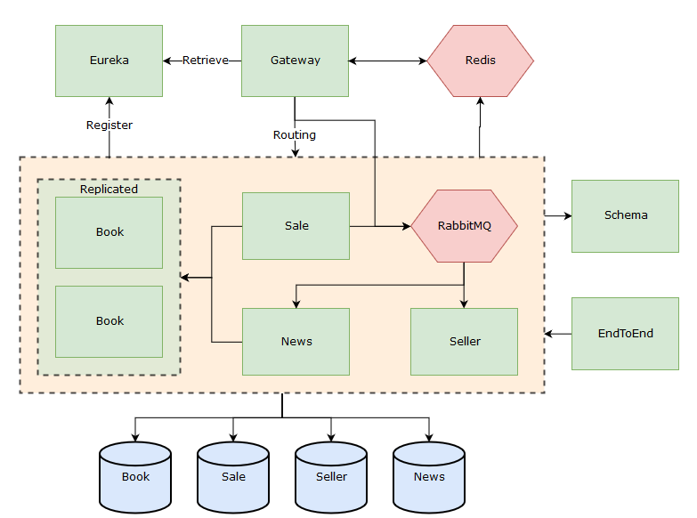

# Exam
This repository is my delivery of the 72h home exam in the subject PG6100 Enterpriseprogramming 2.
"Curriculum" and code inspiration can be found in Andrea Arcuri's (lecturer) repository found [here.](https://github.com/arcuri82/testing_security_development_enterprise_systems)

Exam text can be found [here.](pg6100_exam_continuation_18.pdf)

## About
This application represents the backend of a used books trading site.
It contains the following modules with the following functionality:

#### Gateway:
The gateway module uses Netflix Zuul for routing and filtering of incoming requests and is the only entry-point of the 
application. Gateway holds information about "AuthUsers", meaning state about the currently logged on user.

**API:** Users can register, login, logout and get their own account information. 

#### Eureka:
The Eureka module uses Netflix Eureka and is responsible for service registration and load balancing of the modules. 

#### Book:
The book module represent the data about the books that are for sale. Only "static" data is stored such as title, 
author and edition (but can easily be expanded). The intention behind this is so that the entities can be re-used, and 
it also creates the possibility using a list when adding a book rather than typing in the information themselves.

**API:** Users can find and create books. However, only the admin is allowed to update and delete the books.

#### Seller:
The seller module represent a person registered in the application. It contains user and contact information that is 
not is not suitable to store in the gateway. 

**API:** Users can only retrieve seller information. Creation and updates happens through MQ messages.

#### Sale:
The sale module represent the "intent" or "action" of selling a book. It is the binding layer between a seller and a 
book. The user selects, or creates a book from the book module and then adds custom information about their book in 
particular, such as condition of the book and price.

**API:** Users can create, update, delete and retrieve sales (with filters). Users can only manipulate their own sales 

#### News:
The News module represent a news-feed of the latest books that are for sale. Whenever a new sale har been created, the 
news-feed will be updated. This also applies to updates and removal of the sales.

**API:** Users can retrieve all news, with or without "latest" filter. News manipulation are triggered from rabbitMQ

#### RabbitMQ:
Although not a module it has a core part in the system. Below is an overview:

Sender  | Message      | Listeners
------- | ------------ | ------------
Gateway | user-created | seller
Sale    | sale-created | seller, news
Sale    | sale-updated | news
Sale    | sale-deleted | seller, news

  

#### Requirements
Since I have used a bit different approach than perhaps what was intended, some requirements might be in the gray area. 
Therefore I am listing the requirements and how I resolved them, wherever I fear there might be a possibility for 
misunderstanding

* Req 6. Extra functionality: I feel most of this point is covered in the "about" section, however here is brief list:
  * Documentation-controller gathering all documentation to a single endpoint
  * Login/Logout functionality
  * The rest of the functionality is tied to a more advanced data model, the amount of endpoints and 
  scalability/maintainability of the application. Better details are found in the API documentation 
* Feature 1b: Check if user has book for sale: This is done by using the sale api instead.
* Feature 1c: Resolved by calling GET: /sales/books/{id}. Although a list of sales, every user can be found inside.
* Feature 2: By "modify" i interpreted it as altering an existing entity. Therefore an regular user can create books,
 but not edit them. However, the user can edit the sale entity so that price and condition can be updated.

#### Swagger
After booting all applications, they can all be reached at the same time from gateway @ <http://localhost:8080/swagger-ui.html>
If not wanted, they can be run by themselves in these classes with these endpoints:
  * GatewayApplication 
    * <http://localhost:8080/swagger-ui.html>
  * BookApplication
    * <http://localhost:8081/swagger-ui.html>
  * SaleApplication
    * <http://localhost:8082/swagger-ui.html>
  * SellerApplication
    * <http://localhost:8083/swagger-ui.html>
  * NewsApplication
    * <http://localhost:8084/swagger-ui.html>

#### Running/Testing
Requirements: 
- Docker is running
- Exposed daemon on TCP without TLS in Docker settings
- Increase allocated memory to Docker (I used 8gb)

##### Running:
1. `mvn clean install -DskipTests`
2. `docker-compose up --build`
3. Wait for a while for containers to run and register
4. When done: `docker-compose down` 

##### Testing:
`mvn clean verify`

**If tests fail:**

From personal experience I have had a lot of problems with docker/testcontainers being very unstable, especially when 
run from maven. If it fails, its normally when pulling the images, the process will crash and the docker-engine will be 
broken. This seems to be caused by different processes trying to use the same global variable in the OS, I personally 
had a driver for my mouse that do this (see ref.). After disabling the driver it improved a lot, but 
the success rate is still not 100%.

Other cases with instability in tests include error where there are "No instances available" and general 
ZuulException.

Please keep this in mind.

If `mvn clean verify` fails, I urge you to try again with a different state.
Some steps i found useful:
* Restart computer
* Shut down processes that could interfere with the tests 
*  `docker system prune -a` (deletes all local images)
* Run test manually from IDE 
* Use different computer
* All of the above

Docker crash ref:
* https://github.com/docker/for-win/issues/2007
* https://github.com/docker/for-win/issues/1723
* https://github.com/docker/for-win/issues/1563
* https://www.reddit.com/r/docker/comments/815l9n/docker_for_windows_wont_start_if_razer_synapse_3/

**Note:**
A lot of the tests is based on preloaded data. Initialization happens in the ApplicationConfig classes.

#### Further
Because of time limitation, some shortcuts has been made. Below is what further development would have involved:
* Frontend
* Bug fixes. Big scale and little time means a lot of unverified bugs
* Whenever a book is updated, the news should reflect the change
* If a sale is updated, the latest news should put the changed sale on top
* RabbitMQ container is being initialized in Sale tests. The only reason is so that it wont crash when publishing 
message. That needs to be fixed.
* Fix that there is a login popup when looking at gateway swagger-ui, even though the endpoint is enabled in the 
securityConfig. The page works fine and the popup can be blocked, you can also log in and it will disappear.
* More constraints on entity, string length etc.
* Better validation of input in API
* Better responses from API
* Improve code quality
* More API endpoints
* Better test coverage, more unit tests per endpoint

